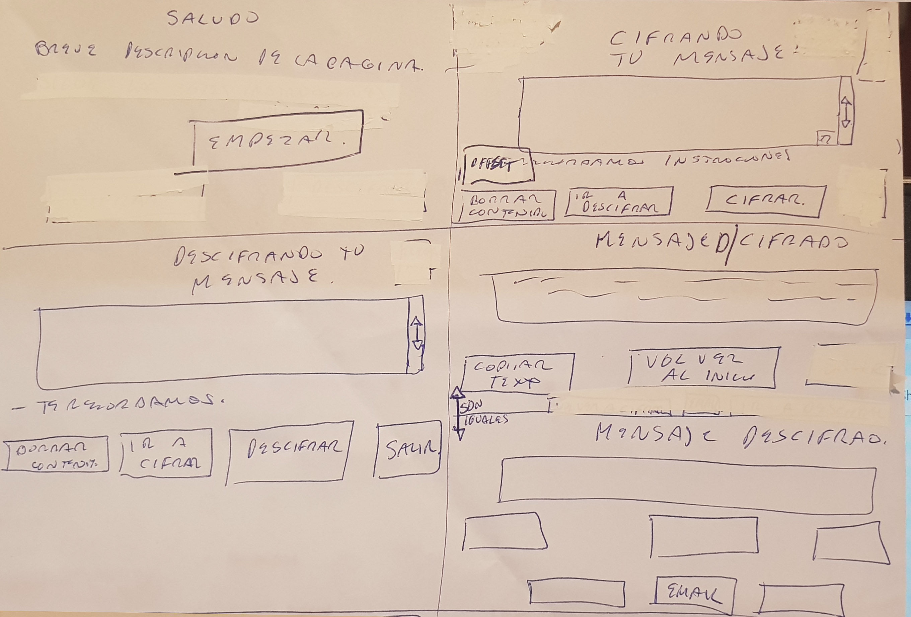
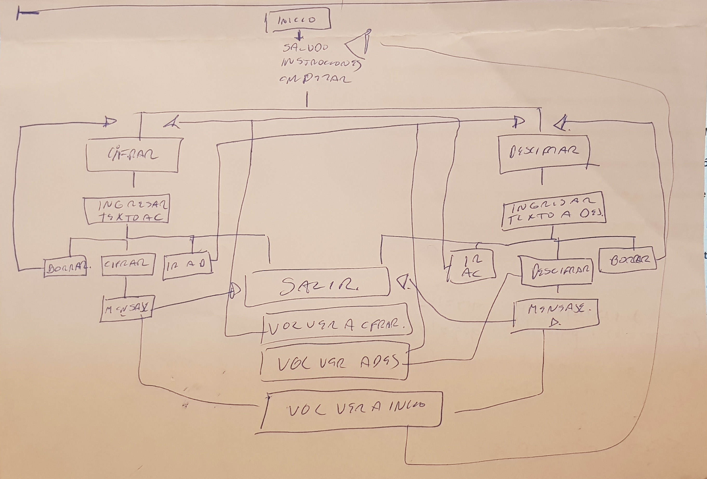
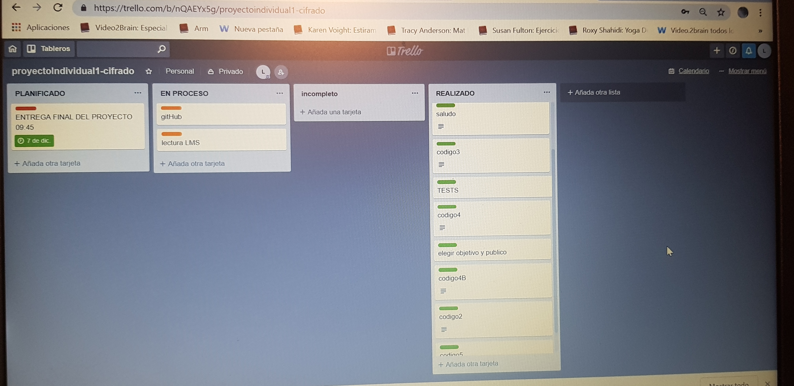
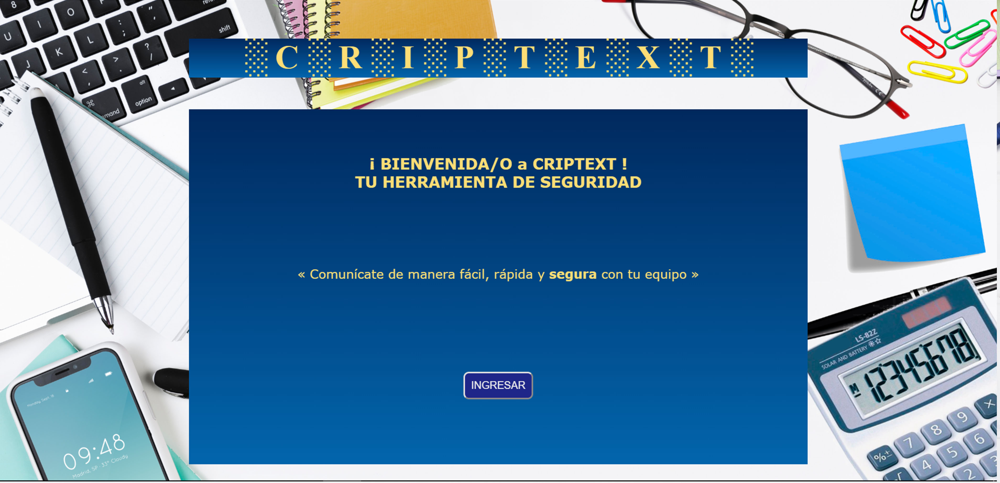
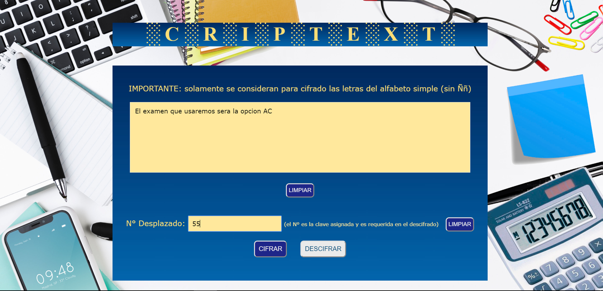
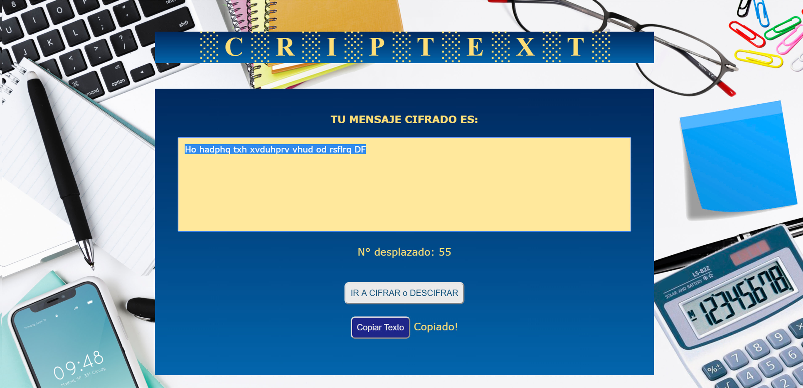
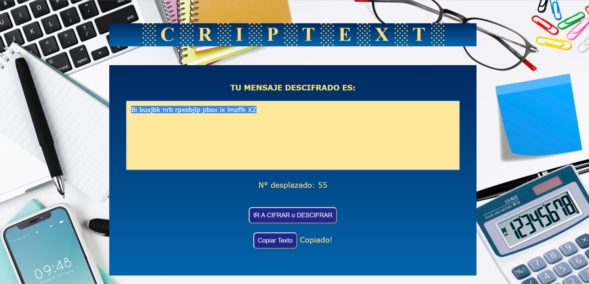
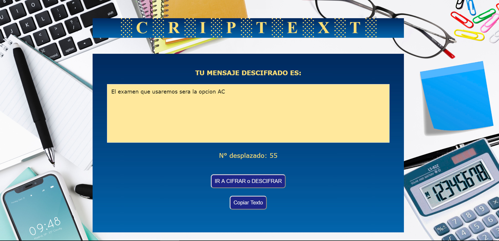
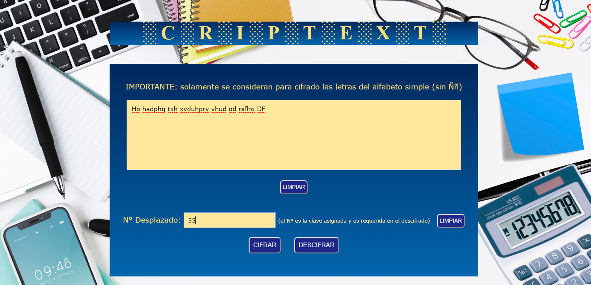

# **« CRIPTEXT »**

## DESCRIPCIÓN: herramienta de criptografía que utiliza el método CIFRADO CESAR

## OBJETIVO GENERAL: Comunicación escrita mediante cifrado y descfirado de mensajes

## USUARIOS OBJETIVO: Integrantes de comités encargados de los procesos de selección de talento humano en la Aerolínea "AirLab"
___
## TABLA DE CONTENIDO

[1.PLANTEAMIENTO DEL PROBLEMA](#1.-PLANTEAMIENTO-DEL-PROBLEMA)

[2.ANÁLISIS DEL PROBLEMA](#2.ANÁLISIS-DEL-PROBLEMA)

[3.PLANTEAMIENTO DE LA SOLUCIÓN](#3.-PLANTEAMIENTO-DE-LA-SOLUCIÓN)

[4.DESCRIPCIÓN DE LA HERRAMIENTA DE CRIPTOGRAFÍA "CRIPTEXT"](#4.-DESCRIPCIÓN-DE-LA-HERRAMIENTA-DE-CRIPTOGRAFÍA-"CRIPTEXT")

[4.1.CRIPTOGRAFÍA](#4.1.-CRIPTOGRAFÍA)

[4.2.MÉTODO "CIFRADO CESAR"](#4.2.-MÉTODO-"CIFRADO-CESAR")

[5.DESCRIPCIÓN DEL DISEÑO](#5.-DESCRIPCIÓN-DEL-DISEÑO)

[5.1.PROTOTIPO](#5.1.-PROTOTIPO)

[5.2.EXPLICACIÓN DEL NOMBRE DE LA HERRAMIENTA](#EXPLICACIÓN-DEL-NOMBRE-DE-LA-HERRAMIENTA)

[5.2.1.CRIPTEX](#CRIPTEX)

[5.2.2.TEXTO](#TEXTO)

[5.3. PROCESO Y DESARROLLO](#5.2.-PROCESO-Y-DESARROLLO)

[5.4. GUÍA RÁPIDA PARA USAR LA HERRAMIENTA](#5.3.-GUÍA-RÁPIDA-PARA-USAR-LA-HERRAMIENTA)

[6. AUTORÍA](#6.-AUTOR)

_____________________________

### 1. PLANTEAMIENTO DEL PROBLEMA

La empresa “AirLab” realiza de manera continua y masiva procesos de selección de personal para contratación en sus diferentes áreas, recibiendo por lo general una considerable cantidad de postulantes en sus áreas operativa y técnica.
Para efectuar estos procesos de selección designa en cada evento un comité conformado por cinco o más miembros, quienes deben comunicarse de manera frecuente para coordinar los diferentes aspectos inherentes a dichos procesos, como ser:

* Información de los seleccionados, preseleccionados y descalificados.
* Definición, cambio y adición de parámetros de calificación y descalificación.
* Selección de los exámenes de evaluación, modificaciones del contenido de exámenes, parámetros de puntaje, cambios por contingencias, etc.
* Otra información relevante.

En reiteradas oportunidades, la empresa se ha enfrentado al problema de la filtración de su información, situación que, además de los perjuicios obvios, ha impedido la optimización del tiempo de los miembros del comité, quienes se han visto obligados a contactarse de manera personal o generar reuniones extras para transmitir información reservada. En este sentido, es necesaria una solución para manejar de manera confidencial, ágil, y práctica la información, coordinación y comunicación entre los integrantes de cada comité designado.
__________________________
### 2. ANÁLISIS DEL PROBLEMA
Se ha determinado con el cliente que una forma óptima de comunicación y manejo de la información planteada en el punto anterior, sería utilizar una herramienta de codificación de mensajes que permita a los miembros de sus comités comunicarse de manera segura y dinámica.
______________________________
### 3. PLANTEAMIENTO DE LA SOLUCIÓN
De esta manera, se presenta a la empresa “AirLab” la herramienta CRIPTEXT, que permite el cifrado y descifrado de mensajería, siendo definido por el comité el parámetro de desplazamiento que puede ser asignado según su preferencia.
_____________________________
### 4. DESCRIPCIÓN DE LA HERRAMIENTA DE CRIPTOGRAFÍA "CRIPTEXT"
La herramienta CIRPTEXT, ha sido creada basada en el metodo de criptografía "Cifrado Cesar".

#### 4.1. CRIPTOGRAFÍA
La criptografía reúne el conjunto de estudios y técnicas para entablar comunicación entre dos partes de forma segura,mientras se evita que una tercera parte externa sea capaz de comprender la información que se encuentra en el mensaje.

#### 4.2. MÉTODO "CIFRADO CESAR"
Llamado así debido a que una de las primeras referencias que se tiene de su utilización se encuentra en las cartas estratégicas que Julio Cesar enviaba a sus aliados. 

 

¿En qué consiste este sistema? Simplemente, se trata de crear un texto difícil de leer -el texto “cifrado”- realizando una serie de cambios sencillos en el texto original. El cifrado de César suele llamarse también “cifrado por desplazamiento” o “desplazamiento de César”, debido a que los cambios que se efectúan consisten únicamente en reemplazar cada letra del texto original por otra que se encuentra un número fijo de posiciones más adelante en el alfabeto. Este número de posiciones será la clave que se necesita para descifrar posteriormente el mensaje. Así en un simple ejemplo si se quisiera cifrar la letra a con una clave = 6 (desplazamiento), simplemente se debe desplazar la letra 6 posiciones en el alfabeto: a, b, c, d, e, f, g. Para descifrar la g, se repite el proceso pero en orden contrario: g, f, e, d, c, b, a. 

Aunque puede aplicarse con desplazamientos de cualquier valor, Julio César solía utilizar un desplazamiento de tres posiciones en casi todos sus mensajes. De esa forma, cada letra A del texto original era sustituida por una D -porque se encuentra 3 lugares a la derecha de la A-, cada B se reemplazaba por una E, y así sucesivamente. 

Cuando la letra a reemplazar está lo suficientemente cerca del final del alfabeto como para que su reemplazo “caiga” fuera de éste (por ejemplo, la Y o la Z), se comienza nuevamente por el principio, como si el alfabeto fuese “circular”, continuando con la A, B, C, etc. luego de la X, Y, Z. 
__________________
### 5. PROCESO Y DESCRIPCIÓN DEL DISEÑO

#### 5.1. PROTOTIPO
Se elaboró previamente el esquema y digarama de flujo siguientes:

 

 

También se efectuó la planificación de actividades utilizando la herramienta web www.trello.com

link: https://trello.com/b/nQAEYx5g/proyectoindividual1-cifrado

#### 5.2. EXPLICACIÓN DEL NOMBRE DE LA HERRAMIENTA

Se ha creado el nombre como resultado de una combinación de dos palabras CRIPTEX (Cryptex en idioma inglés) y TEX (Como las primeras tres palabras de la palabara Texto).

##### 5.2.1. CRIPTEX

Un criptex es un artilugio de forma cilíndrica mencionado en la novela "El código Da Vinci" escrita por Dan Brown, para ocultar secretos en su interior. En el interior del criptex se encuentra un papiro, el cual está enrollado alrededor de una probeta con vinagre. Esta probeta se rompe con un mecanismo si el criptex se fuerza o recibe un golpe, como resultado el papiro se estropea, el vinagre literalmente disuelve el papiro, mermando la integridad física del mismo hasta el punto de volverlo una pasta semi-líquida y emborronando por completo cualquier texto que haya estado escrito en él. De este modo, la única forma de abrirlo es conocer previamente la contraseña y manejándolo en todo momento con cautela (debido a que los golpes también rompen la probeta interna con vinagre). El criptex está rodeado de letras o números que giran formando palabras y combinaciones. Cuando se alinean correctamente, se puede acceder al interior del criptex. 

##### 5.2.2. TEXTO

Conjunto de enunciados que componen un documento escrito.

#### 5.3. PROCESO Y DESARROLLO
Partiendo del esquema prototipo en papel, se ha procedido al desarrollo de la herramienta, basando su diseño en los siguientes aspectos:
- Ambiente de Oficina. Una herramienta importante dentro del material básico en el puesto de trabajo para realizar las labores diarias inherentes al Área.
- Combinación de colores que guardan sobriedad, tratando de evitar el tedio que producen colores muy oscuros. Se pretende evitar la sobrecarga de imágen y colores abundantes.
- Tipografía sin Serif, para la fácil lectura. (Solamente se usó letra con Serif para resaltar y contrastar el título.)
- Se inclulyó una caja de texto grande para el ingreso del mensaje, en razón de que el fin del uso es transcibir, en su mayoría, texto de largo o mediano contenido. 
- Se incluyeron dos botones de limpiado de contenido ingresado, para facilitar la comodidad del usuario, tratandose de botones independientes, uno para la sección de Texto y otro para la sección del Número que indicará el desplazado el texto al cifrar.
- Se incluye el boton de seleccionar y copiar texto en la papelera, en la sección donde se muestra el mensaje cifrado o descfirado, para mayor comodidad del usuario, pudiendo copiar en la ventana para proceder con la operación de cifrar o descifrar, o para copiar el texto en otra herramienta que el usuario prefiera (Ejemplo: Word, Correo electrónico, Messenger, Whatsapp, etc.)
- Se ha incluido en la página de resultado la información del Número Desplazado, a fin de evitar que por un posible olvido se sufra la pérdida de información que además pudiera ser extensa.

#### 5.4. GUÍA RÁPIDA PARA USAR LA HERRAMIENTA

1. Ingresar a la dirección WEB que sea asignada por la empresa.

2. Se  tiene una pantalla de saludo e inicio, en la cual se deberá clickear el botón INGRESAR.

 

3. Se han señalado dos pasos dentro de esta pantalla: 
Paso 1: Donde debe ser ingresado el texo a cifrar o descifrar.
Paso 2: Donde deberá ser ingresado el número de desplazamiento que se desee o que haya sido previamente coordinado por el Comité.
Se tienen señalados los botones que van a ser presionados, ya sea para borrar el contenido ingresado o para proceder con el Cifrado o Descifrado.

 

 

4. Una vez presionado el botón de cifrar o descifrar, se llega a la pantalla de resulado, donde se muestra el mensaje cifrado o el  mensaje descifrado. Se tiene el botón de seleccionar y copiar texto, lo cual guardará en el portapapeles el mensaje elegido.

 

 

5. Existe la opción de volver a cifrar o descifrar, clickeando el botón señalado según corresponda.

 

 

____________________

### 6. AUTORÍA

Lorena De La Riva  
ESTUDIANTE LABORATORIA, Santiago de Chile 

